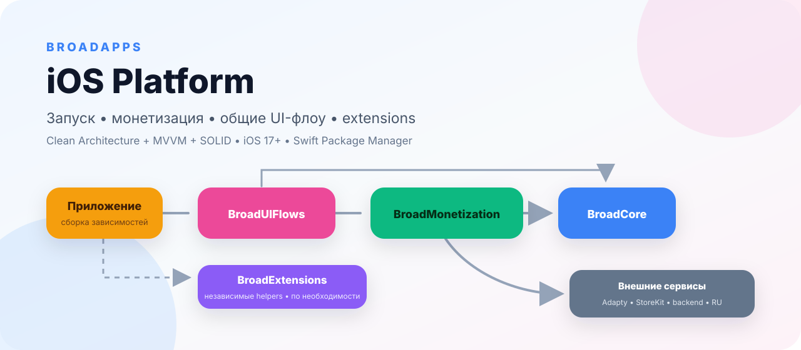
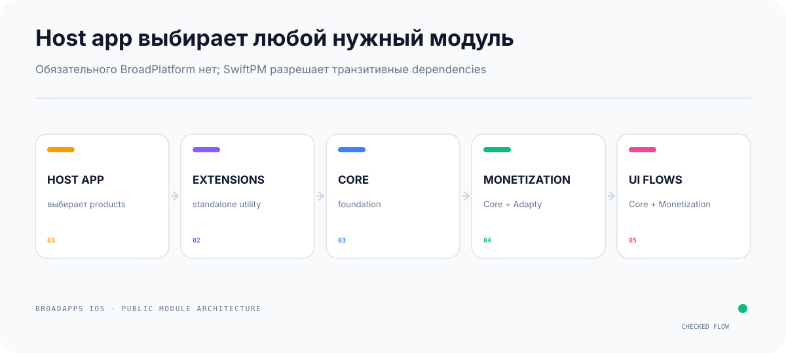

# BroadExtensions

<p align="center">
  <picture>
    <source media="(prefers-color-scheme: dark)" srcset="Documentation/Assets/README/hero-dark.svg">
    <source media="(prefers-color-scheme: light)" srcset="Documentation/Assets/README/hero-light.svg">
    
  </picture>
</p>

<p align="center">
  
  
  
  
</p>

Небольшие публичные SwiftUI/UIKit helpers без бизнес-логики и зависимостей от
других BroadApps-модулей.

[Документация BroadApps iOS](https://broadapps-ios-docs.nkhsnv.chatgpt.site) ·
[Создание приложения](https://broadapps-ios-docs.nkhsnv.chatgpt.site/docs/app-creation) ·
[Changelog](CHANGELOG.md) ·
[Публичный API](Documentation/PublicAPI.md) ·
[Как предложить правку](CONTRIBUTING.md)

**Быстрый маршрут:** [установка](#installation) · [примеры](#minimal-examples) ·
[public API](#public-entry-points) · [Gallery](#gallery) · [проверка](#проверка)

## Что делает модуль

- преобразует `RGB`, `RGBA`, `RRGGBB` и `RRGGBBAA` в typed RGBA, SwiftUI
  `Color` или UIKit `UIColor`;
- регистрирует custom fonts из выбранного bundle и создаёт Dynamic Type fonts;
- закрывает клавиатуру simultaneous gesture без перехвата дочерних tap;
- возвращает системный interactive swipe-back локально для экрана.

## Что модуль принципиально не делает

- не содержит bootstrap, monetization, navigation flow или product decisions;
- не зависит от `BroadCore`, `BroadMonetization` или `BroadUIFlows`;
- не применяет global swizzling;
- не добавляет непредсказуемые общие extensions без префикса;
- не хранит ключи, пользовательские данные или configuration приложения.

## Product и dependencies

| Product | Platform | BroadApps dependencies | External dependencies |
|---|---|---|---|
| `BroadExtensions` | iOS 17+, iPhone | нет | нет |

Host app подключает этот repository только по надобности. Обязательного umbrella
package нет.

<picture>
  <source media="(prefers-color-scheme: dark)" srcset="Documentation/Assets/README/platform-module-selection-dark.svg">
  <source media="(prefers-color-scheme: light)" srcset="Documentation/Assets/README/platform-module-selection-light.svg">
  
</picture>

`BroadExtensions` — единственный полностью standalone product в federation.
Его подключают только если нужны helpers; он не тянет bootstrap, Adapty,
StoreKit, paywall или navigation flow.

## Installation

В Xcode выберите `File → Add Package Dependencies…` и укажите:

```text
https://github.com/BroadApps-official/broad-extensions-ios
```

Для Swift Package:

```swift
dependencies: [
    .package(
        url: "https://github.com/BroadApps-official/broad-extensions-ios",
        from: "1.0.1"
    )
]
```

Добавьте product `BroadExtensions` только нужному iPhone target, затем:

```swift
import BroadExtensions
```

## Minimal examples

### Hex color

```swift
let accent = Color(broadHex: "#4F8CFF")
let overlay = UIColor(broadHex: "101828CC")
```

Некорректный hex возвращает `nil`. Typed parser можно использовать без создания
UI-типа:

```swift
let rgba = BroadRGBAColor(hex: "#0F08")
```

### Custom fonts

```swift
try BroadFontRegistrar.register(
    resourceNames: ["Inter-Regular", "Inter-Bold"],
    withExtension: "ttf",
    in: .main
)

let title = Font.broadCustom("Inter-Bold", size: 28, relativeTo: .title)
let body = UIFont.broadCustom("Inter-Regular", size: 16)
```

Ошибка отсутствующего файла или регистрации возвращается typed-значением
`BroadFontRegistrationError`, а не скрывается.

### Keyboard dismiss

```swift
Form {
    TextField("Email", text: $email)
}
.broadDismissKeyboardOnTap()
```

### Scoped swipe-back

```swift
DetailView()
    .navigationBarBackButtonHidden(true)
    .broadInteractiveSwipeBack()
```

Bridge сохраняет прежний gesture delegate и восстанавливает его при закрытии
экрана.

## Public entry points

- `BroadRGBAColor`;
- `Color.init?(broadHex:)`;
- `UIColor.init?(broadHex:)`;
- `BroadFontRegistrar.register(...)`;
- `Font.broadCustom(...)`;
- `UIFont.broadCustom(...)`;
- `View.broadDismissKeyboardOnTap()`;
- `View.broadInteractiveSwipeBack()`.

Полный автоматически обновляемый список: [Public API](Documentation/PublicAPI.md).

## Contract probe

Runtime probe компилирует настоящий `BroadRGBAColor` production source и
проверяет 3/4/6/8-digit parsing, alpha и fail-closed invalid input:

```bash
bash Scripts/run_contract_probes.sh
```

Probe не использует XCTest/Swift Testing и не обращается к сети.

## Gallery

```bash
bash Scripts/generate_gallery.sh
open Examples/BroadExtensionsGallery/BroadExtensionsGallery.xcodeproj
```

Gallery показывает цвета, keyboard dismiss и scoped swipe-back на iPhone. Она
является sandbox модуля, а не дизайном конкретного приложения.

## Проверка

```bash
bash Scripts/module_gate.sh
```

Gate проверяет структуру, запрет test targets, imports, secrets, форматирование,
lint, executable contract probe, Swift Package, iPhone Gallery, generic unsigned
iOS compile, DocC, ссылки и public API report.

## Versioning

Модуль выпускается независимо по SemVer:

- patch — обратно совместимое исправление;
- minor — новый обратно совместимый public API;
- major — несовместимое API/behavior изменение.

Проверенные cross-module combinations публикуются в integration compatibility
catalog. Changelog каждого release объясняет, что изменилось и почему.

## Documentation

- [Module guide](Documentation/BroadExtensions.md);
- [DocC landing](Sources/BroadExtensions/BroadExtensions.docc/BroadExtensions.md);
- [Public API](Documentation/PublicAPI.md);
- [Public searchable docs](https://broadapps-ios-docs.nkhsnv.chatgpt.site).

Документы публичны. Любой разработчик может предложить правку через pull request
или ссылку `Edit this page` на сайте.

## Contribution

Создайте branch, внесите одну сфокусированную правку, обновите документацию и
changelog, запустите `bash Scripts/module_gate.sh`, затем откройте pull request.
Подробности: [CONTRIBUTING.md](CONTRIBUTING.md).
